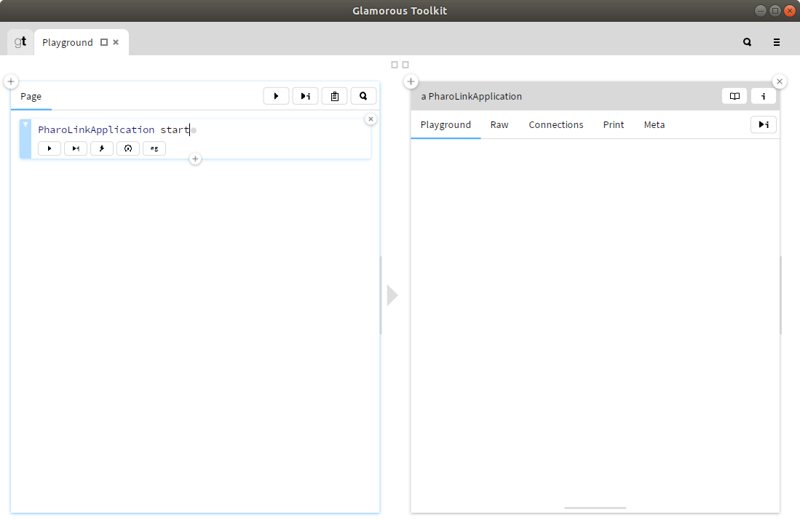

# PharoLink

PharoLink provides a mechanism for Pharo to communicate with remote Pharo processes.

- [Getting Started](#getting-started)
	- [Installation](#installation)
	- [First statements](#first-statements)
	- [Programmatic Use](#programmatic-use)
- [Garbage Collection](#garbage-collection)
- [Callbacks](#callbacks)
- [Automated Tests](#automated-tests)
- [ToDo](#todo)
- [Futures](#futures)
- [Acknowledgements and Thanks](#acknowledgements-and-thanks)


## Getting Started


### Installation

Requirements:

PharoLink has been tested with Pharo 8

To install PharoLink evaluate:

```smalltalk
EpMonitor disableDuring: [ 
Metacello new
	repository: 'github://feenkcom/Pharolink/src';
	baseline: 'PharoLink';
	load ]
```


### First statements

When first running JSLink it is worthwhile starting Pharo from the command line so you can monitor the output.

Open a playground in [Gtoolkit](https://gtoolkit.com/) and start the JSLinkApplication:




We can now evaluate our first expression in the remote server:


After typing the code in to the playground it is evaluated by pressing the play & inspect button:


From here we can navigate through the attributes of the object in the same way as when inspecting pharo objects.

If the value of the attribute is a non-primitive object, a proxy will be returned, if it is a primitive, it will be returned directly:


As well as inspecting the raw values of the remote object, any views which can be represented declaratively, or which have been explicitly specified by the remote object will also be displayed, e.g. the String, List and Columned List views shown below:


When evaluating statements in a proxy object's playground, `self` is bound to the proxy object:


The remote server can then be stopped with:

```smalltalk
PharoLinkApplication stop.
```


### Programatic Use

So far we have been using a global instance of PharoLink, however it is also possible to have multiple servers running concurrently through the use of private instances.

PharoLink allows Pharo code to be supplied in two ways:

1. Strings of code, and
1. AST objects generated using `RBParser`

First, using strings:

```smalltalk
"Start PharoLink"
pharolink := PharoLinkApplication withDefaultSettings.
pharolink start.

"Create an instance of the test inspectable and retrieve the string"
object := pharolink newCommandFactory
	<< 'GtDeclarativeTestInspectable new';
	sendAndWait.

date := object newCommandFactory
	<< 'self collectionOfObjects second';
	sendAndWait.

"Stop the server"
pharolink stop
```


Second, using JavaScript generated with `RBParser`:

```smalltalk
"Start PharoLink"
pharolink := PharoLinkApplication withDefaultSettings.
pharolink start.

"Generate the expression and evaluate"
node := RBParser parseExpression: 
	'| inspectable hw |
	inspectable := GtDeclarativeTestInspectable new.
	hw := inspectable collectionOfObjects second.
	hw'.

date := pharolink newCommandFactory
	<< node;
	sendAndWait.

"Stop the server"
jslink stop
```


## Garbage Collection

Proxy objects register them selves for finalisation.  When they are garbage collected in Pharo they are automatically removed from the registry in the node.js server.


## Callbacks

Callbacks in to Pharo from the remote server are supported through observables.

See `PharoLinkSendCommandTest` for examples of setting up and using callbacks.


## Automated Tests

See the 'PharoLink-Tests` package.

## ToDo

`PythonBridge` supports communicating with the server using either HTTP or [MsgPack](https://msgpack.org/).  While the code has been left in the package, MsgPack is not yet supported.


## Futures

TBS.


## Acknowledgements and Thanks

Thanks to the team at [ObjectProfile](http://www.objectprofile.com/) for making [PythonBridge](https://github.com/ObjectProfile/PythonBridge), on which PharoLink is based.
